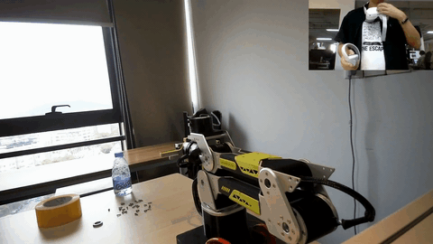
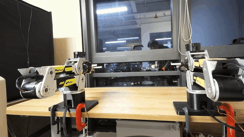

# reBot VR Teleoperation

基于 PICO 4 和 LeRobot 的 reBot B601-DM 单／双臂遥操，支持 pose QP、分离式 IK、MIT／POS_VEL 控制和夹爪控制。

<p align="center">
  <table>
    <tr>
      <td align="center"></td>
      <td align="center"></td>
    </tr>
  </table>
</p>
## 安全须知

- 配置可使机械臂在启动后自动移动，即使未按下 Grip。运行前核对零位、关节方向和运动区域，先做低速验证。
- 退出默认断使能，机械臂可能下坠；须准备可靠支撑和急停，支撑不能阻挡测试运动。
- MIT 模式为实验性功能，需验证增益与重力补偿方向；`mit_torque_limit_nm` 仅限制前馈，不是总输出扭矩限制。
- 双臂目前要求基座竖直、同向并排、两条独立 CAN 总线；没有跨臂碰撞检测或共同物体约束。

## 安装与 VR 连接

要求：Linux、Python 3.12+、LeRobot 0.6.x（含 `rebot` extra）、达妙串口转 CAN，以及 PICO 4。

在工程根目录执行：

```bash
uv venv --python 3.12 .venv
source .venv/bin/activate
uv pip install -e .
```

已有 LeRobot 环境时，直接安装到该环境，无须新建：

```bash
uv pip install --python ~/Python/lerobot/.venv/bin/python -e .
source ~/Python/lerobot/.venv/bin/activate
```

PICO 开启开发者模式和 USB 调试后安装发送端：

```bash
adb install -r assest/reBot.apk
```

发送端填写主机局域网 IP、端口 `63901`，不能填写 `0.0.0.0`。可先用以下命令检查数据，不连接机械臂；检查完退出，释放端口：

```bash
rebot-vr-print --host 0.0.0.0 --port 63901 --hand right --rate 10
```

## 零位标定

停止其他串口程序，确认电机 ID 1–7 在线，按标定程序提示操作。每条臂分别标定，`robot.id` 必须与遥操配置一致：

```bash
# 单臂示例；串口按实际连接修改
lerobot-calibrate \
  --robot.type=rebot_b601_follower \
  --robot.port=/dev/ttyACM0 \
  --robot.id=rebot_b601_vr
```

双臂分别使用配置中左／右臂的串口及 `rebot_left`／`rebot_right`。双臂入口缺少标定会报错，不要靠跳过检查或放宽到位容差处理零位偏差。

## 双臂运行

编辑 [config/dual_mit_split.yaml](config/dual_mit_split.yaml)，核对：

- `arms.left/right.robot_port` 与实体左右臂一致，`robot_id` 不同。
- `control_config` 选择各臂的单臂配置，`overrides` 覆盖对应臂参数；文件路径相对于双臂 YAML 所在目录。
- 当前使用 `/dev/serial/by-path/...` 固定 USB 插口。不要交换线缆插口；更换主机或 USB 拓扑后重新核对。只有适配器序列号各自唯一时才使用 `by-id`。

```bash
# 仅检查生效配置，不连接硬件
rebot-vr-teleoperate-dual --config config/dual_mit_split.yaml --dry-run

# 低速启动／回零验证：会驱动机械臂，禁用 VR
rebot-vr-teleoperate-dual --config config/dual_mit_split.yaml --startup-zero-test

# 正常双臂遥操
rebot-vr-teleoperate-dual --config config/dual_mit_split.yaml
```

低速验证将启动／回零速度限制在不超过 0.25 rad/s、加速度不超过 0.5 rad/s²；两臂启动到位后等待 2 秒，自动回零并断开。不修改 YAML、增益或容差。正常遥操按 YAML 运行，不沿用本次诊断限速。

若提示命令不存在，重新安装本项目，或使用：

```bash
PYTHONPATH=src python -m lerobot_teleoperator_rebot_vr.runtime.dual \
  --config config/dual_mit_split.yaml
```

## 单臂运行

```bash
# MIT + 分离式 IK；确认标定完成后运行
rebot-vr-teleoperate \
  --robot-port /dev/ttyACM0 \
  --motor-control-mode mit \
  --control-config config/mit_split.yaml
```

首次验证可在上述命令后追加以下参数，跳过启动移动及退出回零，并降低遥操限制：

```text
--no-move-to-initial --no-return-to-zero-on-exit
--position-scale 0.25 --orientation-scale 0.25
--max-joint-speed-rad-s 0.5 --max-joint-acceleration-rad-s2 1.0
--wrist-speed-rad-s 0.5 --wrist-acceleration-rad-s2 1.0
--max-relative-target-deg 5 --wrist-relative-target-deg 5
```

以上为参数清单，追加时用空格或 shell 续行连接。退出仍默认断使能。

## 手柄与退出

| 操作 | 行为 |
| --- | --- |
| Grip | 按住跟随，松开保持 |
| Trigger | 独立控制夹爪，不受 Grip 约束；开合角度由 YAML 决定 |
| 右 A／左 X | 对应臂返回初始姿态 |
| 右 B／左 Y | 对应臂返回六轴零位并闭合夹爪 |
| 第一次 Ctrl+C | 正常运行时，按各臂配置请求回零后退出 |
| 第二次 Ctrl+C／SIGTERM | 中止回零，进入清理流程；不等同于硬件急停 |

启动、跟踪恢复或按键回位后，需先完全松开 Grip 再激活。按键回位不要求按住 Grip，但仍需有效跟踪与反馈。

双臂只有在两侧就绪、跟踪及反馈有效时才允许跟随；任一侧异常会阻止两侧继续跟随，严重故障需检查后重启。启动失败、反馈故障、异常或定时结束不自动回零；断开或阻塞的总线无法保证执行保持／失能命令。

## 配置选择

| 电机控制 | pose QP | split IK |
| --- | --- | --- |
| MIT | `config/mit_pose.yaml` | `config/mit_split.yaml` |
| POS_VEL | `config/pos_vel_pose.yaml` | `config/pos_vel_split.yaml` |

不指定配置时，按电机模式加载 `mit.yaml` 或 `pos_vel.yaml`，默认使用 pose IK。单臂命令行显式参数优先于 YAML，电机模式须与配置一致。

pose 跟踪 TCP 位姿；split 的 q1–q3 跟踪 joint4 轴心位置，q4–q6 跟随手柄相对旋转。建议选择完整配置，不要只改 `ik_mode`。增益、限速、初始姿态和夹爪参数见 [参数说明](assest/docs/PARAMETERS.md)。

## 日志与测试

双臂日志默认保存至 `logs/dual/<运行ID>/`，包含左右臂 CSV、生效配置、延迟统计和退出报告。CSV 的 `phase` 区分启动、遥操与回零；分析采样时筛选 `row_kind=sample`。SDK 缓存状态不是新鲜失能确认，估计扭矩不是实测值。

```bash
# 单臂记录：追加到实际运行命令
# --csv-log logs/session.csv

# 安装测试依赖并运行（不连接机械臂）
uv pip install -e '.[test]'
PYTEST_DISABLE_PLUGIN_AUTOLOAD=1 python -m pytest -q
```

基础 QP 后端为 SciPy；需要 OSQP 时安装 `uv pip install -e '.[qp]'`。更多命令参数使用 `--help` 查看。

## 详细文档

[系统架构](assest/docs/ARCHITECTURE.md) · [API](assest/docs/API_REFERENCE.md) · [控制设计](assest/docs/CONTROL_DESIGN.md) · [逆解设计](assest/docs/INVERSE_KINEMATICS_DESIGN.md) · [参数说明](assest/docs/PARAMETERS.md)

许可证：[Apache-2.0](LICENSE)
