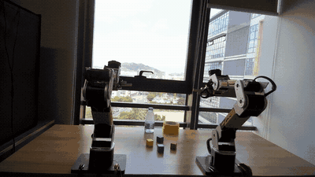

# reBot VR Teleoperation

<h3 align="center">基于 PICO 4 的 reBot B601-DM VR 遥操作系统 (VR Teleoperation for reBot B601-DM with PICO 4)</h3>

<p align="center">
  <a href="https://www.python.org"></a>
  <a href="https://github.com/huggingface/lerobot"></a>
  <a href="assest/docs/INVERSE_KINEMATICS_DESIGN.md"></a>
  <a href="https://www.picoxr.com"></a>
  <a href="LICENSE"></a>
</p>

> 本项目是一个基于 PICO 4 手柄的 reBot B601-DM 机械臂VR 遥操作平台，涵盖位姿映射、分离式逆运动学、MIT/POS_VEL 电机控制与双臂协调，面向遥操作展示与数据采集功能。

* * *

## 项目简介

- **VR 遥操作**：PICO 4 手柄位姿实时映射末端，支持单/双臂操作，Grip 离合、按键回位、夹爪控制。
- **分离式 IK**：q1–q3 位置 QP 跟踪 joint4 轴心，q4–q6 闭式跟随腕姿，腕部转动不干扰肩部跟踪。
- **双臂协调与安全**：双臂支持MIT与POS_VEL模式，可实现同步启动、故障同停、限位内缩、制动预留、故障保持、启动/退出归零。
- **诊断**：用于事后复现与调参分析的CSV 记录、延迟分位数汇总与离线分析的API。

* * *

## 演示视频

<p align="center">
  
</p>

## 系统架构与控制

| 模块 | 职责 | 实现 |
| --- | --- | --- |
| VR 输入 | PICO 4 手柄位姿/按键接收与有效性管理 | `vr/` |
| 逆解 | q1–q3 位置 QP + q4–q6 腕部闭式解 | `ik/` |
| 电机下发 | MIT（重力前馈/有界参考）与 POS_VEL | `control/` |
| 运行时 | 单/双臂主循环、启动归零、故障保持 | `runtime/` |

IK 只有 split 一种。不指定配置时，按电机模式加载 `config/mit_split.yaml` 或 `config/pos_vel_split.yaml`；单臂命令行显式参数优先于 YAML。

| 电机控制 | 单臂配置 | 双臂配置 |
| --- | --- | --- |
| MIT | `config/mit_split.yaml` | `config/dual_mit_split.yaml` |
| POS_VEL | `config/pos_vel_split.yaml` | — |

* * *

## 安全须知

- 配置可使机械臂在启动后自动移动，即使未按下 Grip。运行前核对零位、关节方向和运动区域，先做低速验证。
- 退出默认断使能，机械臂可能下坠；须准备可靠支撑和急停，支撑不能阻挡测试运动。
- MIT 模式为实验性功能，需验证增益与重力补偿方向；`mit_torque_limit_nm` 仅限制前馈，不是总输出扭矩限制。
- 双臂目前要求基座竖直、同向并排、两条独立 CAN 总线；没有跨臂碰撞检测或共同物体约束。

* * *

## 快速上手

### 1. 环境依赖

- Linux、Python 3.12+、LeRobot 0.6.x（含 `rebot` extra）
- 达妙串口转 CAN、PICO 4（开启开发者模式与 USB 调试）

### 2. 安装与标定

```bash
uv venv --python 3.12 .venv
source .venv/bin/activate
uv pip install -e .
```

已有 LeRobot 环境时直接装入，无须新建：

```bash
uv pip install --python ~/Python/lerobot/.venv/bin/python -e .
source ~/Python/lerobot/.venv/bin/activate
```

PICO 侧安装发送端：

```bash
adb install -r assest/reBot.apk
```

> 发送端填写主机局域网 IP、端口 `63901`，不能填 `0.0.0.0`。可先运行 `rebot-vr-print --host 0.0.0.0 --port 63901 --hand right --rate 10` 检查数据（不连接机械臂），检查完退出以释放端口。

零位标定（停止其他串口程序，确认电机 ID 1–7 在线，逐臂标定，`robot.id` 须与遥操配置一致）：

```bash
# 单臂示例；串口按实际连接修改
lerobot-calibrate \
  --robot.type=rebot_b601_follower \
  --robot.port=/dev/ttyACM0 \
  --robot.id=rebot_b601_vr
```

> 双臂分别使用配置中左／右臂的串口及 `rebot_left`／`rebot_right`。双臂入口缺少标定会报错；不要靠跳过检查或放宽到位容差处理零位偏差。

### 3. 运行

```bash
# 仅检查生效配置，不连接硬件
rebot-vr-teleoperate-dual --config config/dual_mit_split.yaml --dry-run

# 低速启动／回零验证：会驱动机械臂，禁用 VR（速度≤0.25 rad/s、加速度≤0.5 rad/s²）
rebot-vr-teleoperate-dual --config config/dual_mit_split.yaml --startup-zero-test

# 正常双臂遥操
rebot-vr-teleoperate-dual --config config/dual_mit_split.yaml
```

> 双臂配置 `arms.left/right.robot_port` 须与实体左右臂一致且 `robot_id` 不同；当前用 `/dev/serial/by-path/...` 固定 USB 插口，不要交换线缆。若提示命令不存在，重新安装本项目，或用 `PYTHONPATH=src python -m lerobot_teleoperator_rebot_vr.runtime.dual --config ...` 运行。

单臂（MIT + split IK，确认标定完成后）：

```bash
rebot-vr-teleoperate \
  --robot-port /dev/ttyACM0 \
  --motor-control-mode mit \
  --control-config config/mit_split.yaml
```

* * *

## 手柄与退出

| 操作 | 行为 |
| --- | --- |
| Grip | 按住跟随，松开保持 |
| Trigger | 独立控制夹爪，不受 Grip 约束；开合角度由 YAML 决定 |
| 右 A／左 X | 对应臂返回初始姿态 |
| 右 B／左 Y | 对应臂返回六轴零位并闭合夹爪 |
| 第一次 Ctrl+C | 正常运行时，按各臂配置请求回零后退出 |
| 第二次 Ctrl+C／SIGTERM | 中止回零，进入清理流程；不等同于硬件急停 |

> 启动、跟踪恢复或按键回位后，需先完全松开 Grip 再激活。双臂只有在两侧就绪、跟踪及反馈有效时才允许跟随；任一侧异常会阻止两侧继续跟随。启动失败、反馈故障、异常或定时结束不自动回零。

## 日志与测试

双臂日志默认保存至 `logs/dual/<运行ID>/`，包含左右臂 CSV、生效配置、延迟统计和退出报告。CSV 的 `phase` 区分启动、遥操与回零；分析采样时筛选 `row_kind=sample`。SDK 缓存状态不是新鲜失能确认，估计扭矩不是实测值。

位置字段均为机器人基座坐标、单位米：`tcp_target_position_*_m` 是映射目标、`tcp_actual_position_*_m` 是反馈、`tcp_position_error_*_m` 是目标减反馈；split 的位置控制点是 joint4 轴心，不是夹爪尖端。逐字段说明与帧对齐（输入/目标/异步 IK 各自的时间戳与 id，不同行不一定是同一输入帧）见 [API 参考](assest/docs/API_REFERENCE.md#csv-与分析)。

```bash
# 单臂记录：追加到实际运行命令
# --csv-log logs/session.csv

# 安装测试依赖并运行（不连接机械臂）
uv pip install -e '.[test]'
PYTEST_DISABLE_PLUGIN_AUTOLOAD=1 python -m pytest -q
```

基础 QP 后端为 SciPy；需要 OSQP 时安装 `uv pip install -e '.[qp]'`。更多命令参数使用 `--help` 查看。

* * *

## 详细文档

[系统架构](assest/docs/ARCHITECTURE.md) · [API](assest/docs/API_REFERENCE.md) · [控制设计](assest/docs/CONTROL_DESIGN.md) · [逆解设计](assest/docs/INVERSE_KINEMATICS_DESIGN.md) · [参数说明](assest/docs/PARAMETERS.md)

* * *

> **项目维护者注**：QP 目标函数、硬约束与奇异性自适应的推导见 [逆解设计](assest/docs/INVERSE_KINEMATICS_DESIGN.md)；MIT 下发与有界位置参考见 [控制设计](assest/docs/CONTROL_DESIGN.md)。

许可证：[Apache-2.0](LICENSE)
